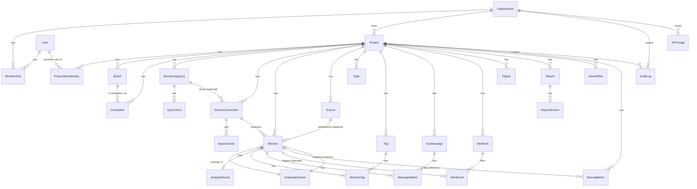

# Database model

Full source of truth: `prisma/schema.prisma`. This is a relationship overview
(entities + how they connect), not every field — see the schema file for
exact columns, types, and defaults.

## Entity-relationship diagram

## Model summary

| Model | Purpose | Key indexes |
|---|---|---|
| `User` | Login identity | `email` unique |
| `Organization` | Tenant | `slug` unique |
| `Membership` | Org-level role (Owner/Administrator/Analyst/Viewer/Client Viewer) | `(userId, organizationId)` unique |
| `Project` | A monitoring workspace; `isDemo` flags synthetic data | `organizationId` |
| `ProjectMembership` | Optional project-level role override | `(userId, projectId)` unique |
| `Brand` | Primary brand or a competitor's brand record | `projectId` |
| `Competitor` | Links a `Brand` into the project's competitive set | `(projectId, brandId)` unique |
| `MonitoringQuery` | Saved Boolean query (visual or expert mode) | `(projectId, isActive)` |
| `QueryTerm` | Visual-mode term rows compiled into the query's expression | `monitoringQueryId` |
| `SourceConnection` | A configured adapter instance (RSS URL, GDELT query, …) | `(projectId, status)` |
| `Source` | A known publication/domain, with Canadian source-type tagging | `(domain, projectId)` unique |
| `IngestionJob` | One polling attempt's status/error/counts | `(sourceConnectionId, createdAt)` |
| `Mention` | A normalized, deduplicated piece of coverage | `(projectId, publishedAt)`, `canonicalUrl`, `duplicateClusterId`, `(projectId, reviewStatus)`, `(projectId, isDemo)`, GIN full-text on headline+body |
| `DuplicateCluster` | A group of near-duplicate/syndicated `Mention`s | `(projectId, fingerprint)` |
| `AnalysisResult` | One mention's AI/mock analysis, labelled by `engine` | `sentiment`, `riskScore`, `relevanceLabel` |
| `Topic`, `Tag`, `MentionTag` | Free-form and structured tagging | — |
| `KeyMessage`, `MessageMatch` | Defined messages and per-mention pull-through | — |
| `AlertRule`, `AlertEvent` | Configured triggers and their firing history | `(projectId, isActive)`, `(alertRuleId, triggeredAt)` |
| `Digest` | Scheduled recipient rollups | `projectId` |
| `Report`, `ReportSection` | Generated executive reports and their traceable sections | `(projectId, templateType)` |
| `SavedFilter` | Per-user saved coverage-feed filters | `(projectId, userId)` |
| `ManualMetric` | Manually-entered reach/AVE figures, always labelled known/estimated/legacy | `projectId` |
| `AuditLog` | Who changed what, when, and why | `(projectId, createdAt)`, `(entityType, entityId)` |
| `APIUsage` | Per-provider daily call/token/cost tracking | `(organizationId, date)` |

## Notable design choices

- **`Mention.isDemo`** is denormalized from `Project.isDemo` at write time so
  every query that must never mix demo and live data can filter on the
  `Mention` row directly, and is indexed (`(projectId, isDemo)`).
- **Full-text search** on `Mention` uses a Postgres generated `tsvector`
  column (`searchVector`, added via a raw-SQL migration since Prisma can't
  express generated columns) with a GIN index, declared in the schema as
  `Unsupported("tsvector")` so Prisma doesn't attempt to manage it directly.
- **`DuplicateCluster.canonicalMentionId`** is nullable to avoid a
  create-order circular FK between `Mention` and `DuplicateCluster`; the
  clustering code always sets it before returning.
